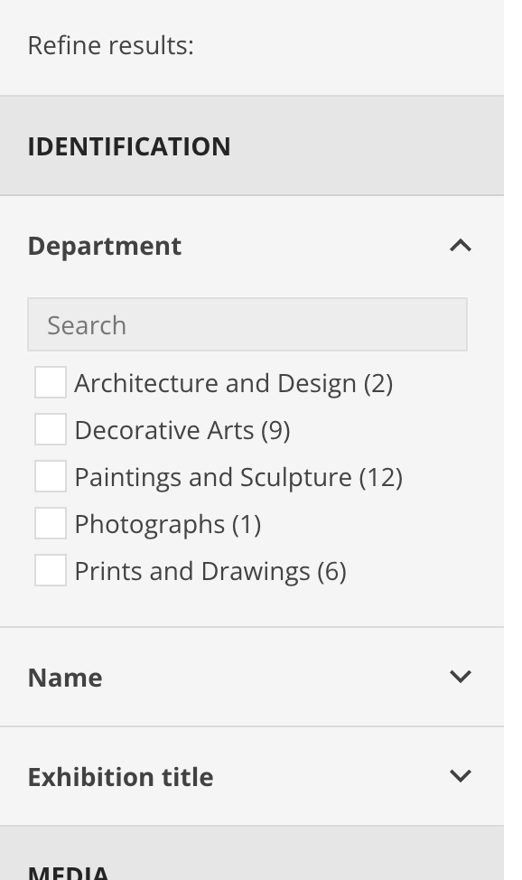

# Adding a field to the public browser


## Overview

A field can be added to the public browser in three ways:

1. **The full text search index**

   A field that is indexed for full text search will be searched when the user enters terms in the keyword search box at the top of the application:

   

   Adding a field to the full text search index only means that the field will be *searchable* from the keyword search box. It does not by itself make the field *visible* in the user interface. To do that, the field should also be added in one or both of the other ways, described below.

1. **The faceted search filter list**

   A field that is configured to be a faceted search filter appears in the list of fields in the "Refine results" sidebar:

   

   This makes it possible for the user to see the values of the field that are present in the current result set, and to select one or more values to further narrow the result set.

1. **The object detail page**

   A field that is configured to appear on the object detail page appears in the listing of fields that appears when the user clicks on a search result to see more information about the object:

   

   A field does not necessarily have to be in the full text index or a faceted search filter to appear on the object detail page.


## Best practices

A CollectionSpace field may be configured to appear in the public browser in any one, two, or all three of the above ways. For a good user experience, follow these best practices:

1. If a field appears in the full text search index, it should also appear on the object detail page.

   Why: If the user finds an object by searching on a term, it is confusing if the term doesn't appear on the detail page. The user won't be able to see why the object was a result of the search.

1. If a field appears on the object detail page, it should also be in the full text search index.

   Why: If the user sees a field value on the detail page for an object, it is confusing if a full text search for that value doesn't find the object.

1. If a field appears in the facet list, it should also appear on the object detail page.

   Why: If a user finds an object by faceting on a particular field value, it is confusing if that value doesn't appear on the detail page. Showing faceted field values also affords pivoting from the object detail page to another faceted search by clicking on a value.

1. The fields that are used as faceted search filters should be carefully selected. Each field that is added as a faceted search filter impacts the performance of the application. In general, a field should only be added as a search facet if it is a controlled list in CollectionSpace. Dates and numbers may also be faceted, as long as they are grouped into ranges. In particular:

   - Fields whose values are unique (for example, identification numbers and titles) *should not* be used as faceted search filters.
   - Fields whose values are long (more than a few words, or anything that could contain multiple lines, for example, descriptions) *should not* be used as faceted search filters.

   Why:
   - The purpose of a faceted search filter is to provide the user with a limited number of choices that can be used to narrow the result set, when the user is not sure of the exact object that they're looking for. If a field used as a filter has a unique value for each result, then the user would already have to know the value they're looking for in order to pick it from the list; in that case, they could have just typed that value into the keyword search box.
   - Faceted search filters that contain many values reduce the performance of the application. For this reason, the number of values displayed for each facet is limited; if there are too many values, the one the user is looking for may not even appear in the list.
   - Long text (like descriptions) tend to be unique, so for the above reasons they should not be filters. Long values will also overwhelm the amount of space available in the sidebar, making faceted search unusable.

### Adding a field to the Elasticsearch index

A field must be indexed in Elasticsearch in order to make it full-text searchable, available as a search facet, or available on the object detail page. To add a field to the index, update the Elasticsearch index configuration for your CollectionSpace tenant.

1. Locate your the CollectionSpace source code directory. In a typical installation, this is `/opt/collectionspace/services`.

1. Locate your tenant bindings configuration delta file, within the CollectionSpace source code directory. This will be located at `services/common/src/main/cspace/config/services/tenants/{tenant shortname}/{tenant shortname}-tenant-bindings.delta.xml`. This file contains overrides to the default tenant configuration for your tenant.

1. In the tenant bindings configuration file, check for an element named `tenant:elasticSearchIndexConfig`. If this element does not exist, copy the element and its contents from the default tenant configuration file, located at `services/common/src/main/cspace/config/services/tenants/tenant-bindings-proto-unified.xml`. Ensure that the copied element is a child of `tenant:tenantBinding`. Add the property `merge:action="replace"` to both the `tenant:tenantBinding` tag and the child `tenant:mapping` tag, as in this example:

   https://github.com/collectionspace/services/blob/master/services/common/src/main/cspace/config/services/tenants/anthro/anthro-tenant-bindings.delta.xml#L15-L16

   The index configuration can now be updated in your tenant bindings file, and your tenant's configuration will override the default.

1. Determine the full name of the field you want to add.
   1. Open a record in the CollectionSpace UI that is known to have a value set for the field. In the URL of the page, the CSID of the record (a UUID) appears at the end.

   1. Retrieve the record from the REST API, using the csid, e.g. at `/cspace-services/collectionobjects/{csid}`. In the XML document that is returned, note the path of element names that lead to the field value. For example, the path for the Object Production Place field is `ns2:collectionobjects_common`, `objectProductionPlaceGroupList`, `objectProductionPlaceGroup`, `objectProductionPlace`. The name in the path, excluding the namespace prefix, is known as the part (or schema) name (in this example, `collectionobjects_common`). The next name in the path is the field name (in this example, `objectProductionPlaceGroupList`). If that field is repeating, or a repeating group, then there are additional elements in the path: The next is the repeating instance name (in this example, `objectProductionPlaceGroup`). If the field is a repeating group, the next element is the nested field name (in this case, `objectProductionPlace`).

1. Check to see if an Elasticsearch mapping already exists for the field you want to index. Look for a field in the Elasticsearch mapping with the name `{part name}:{field name}`, for example `collectionobjects_common:objectProductionPlaceGroupList`. If the field you want to add is in a repeating group, that field should have a `properties` property in the mapping, and the nested field name (in the above example, `objectProductionPlace`) should exist.

1. If the field exists in the mapping, check that it has the `copy_to` property set to `"all_field"`. This says that the field should be indexed for full text search. For example, the mapping for Object Production Place looks like:

   https://github.com/collectionspace/services/blob/a4875dd265294b3969f4e335e218cb63486bd16e/services/common/src/main/cspace/config/services/tenants/tenant-bindings-proto-unified.xml#L1179-L1187

1. If there is no existing mapping for the field, add one. Use the existing field mappings as examples. These include:

   - Single-value field:
      https://github.com/collectionspace/services/blob/a4875dd265294b3969f4e335e218cb63486bd16e/services/common/src/main/cspace/config/services/tenants/tenant-bindings-proto-unified.xml#L1105-L1108

   - Repeating field:
      https://github.com/collectionspace/services/blob/a4875dd265294b3969f4e335e218cb63486bd16e/services/common/src/main/cspace/config/services/tenants/tenant-bindings-proto-unified.xml#L1109-L1112

   - Field in a repeating group:
      https://github.com/collectionspace/services/blob/a4875dd265294b3969f4e335e218cb63486bd16e/services/common/src/main/cspace/config/services/tenants/tenant-bindings-proto-unified.xml#L1179-L1187

   Notes:
   - To add a field to full text search, set `copy_to` to `"all_field"`.
   - A repeating group must have `type` set to `"object"`.
   - A text field that is used in faceted search must have `type` set to `"keyword"`.
   - A text field that is not used in faceted search may have `type` set to either `"keyword"` or `"text"`. Use `"keyword"` if the field is controlled by an option list, term list, authority, or ID generator. Otherwise, use `"text"`.
   - Other `type` values are used for numeric and boolean fields. See the existing field mappings for examples.

1. If the field should appear on the object detail page, add it to the `_source.includes` property in the Elasticsearch configuration. The value should have the format `{part name}:{field name}`. Examples:

   https://github.com/collectionspace/services/blob/master/services/common/src/main/cspace/config/services/tenants/tenant-bindings-proto-unified.xml#L1008-L1040

1. Deploy the updated tenant bindings configuration.

   1. Stop CollectionSpace.
      ```
      sudo systemctl stop collectionspace.service
      ```

   1. As the collectionspace user, deploy the tenant bindings.
      ```
      sudo su - collectionspace

      cd /opt/collectionspace/services/services/common
      ant deploy_tenantconfig
      cd ../JaxRsServiceProvider
      ant deploy_services_artifacts

      exit
      ```

   1. Start CollectionSpace.
      ```
      sudo systemctl stop collectionspace.service
      ```

   1. Reindex Elasticsearch.
      ```
      curl -i -u {your admin username} -X POST http://{your cspace hostname}/cspace-services/index/elasticsearch
      ```
